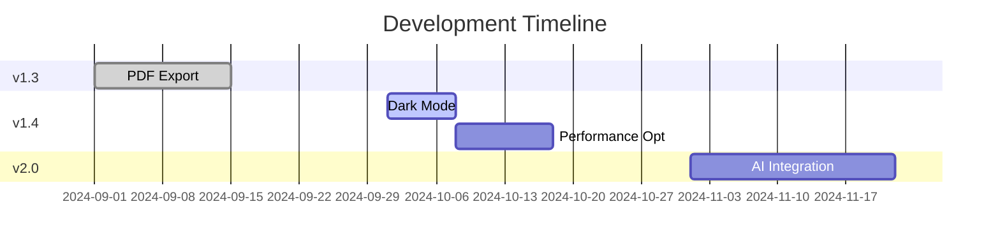

# Professional Card Maker 


[](LICENSE)
[](https://github.com/Rohit03022006/Professional_Card_Maker/issues)

---
A modern React application for creating professional digital business cards with QR code functionality, built with Vite and containerized with Docker for optimal performance.
---


## Features
- Dynamic business card form with real-time preview
- Drag & drop profile photo upload
- QR code generation with customization options
- Fully responsive design (mobile-first approach)
- Docker container support for easy deployment
- Comprehensive form validation
- Blazing fast performance with Vite
- Theme customization support

## Quick Start

### Prerequisites
- Node.js v18+
- Docker v20+
- npm v9+ or pnpm v8+
---
### Project Structure
```
professional-card-maker/
├── src/
│ ├── assets/ # Static assets
│ ├── components/ # Reusable components
│ ├── hooks/ # Custom React hooks
│ ├── styles/ # Global styles
│ ├── utils/ # Utility functions
│ ├── App.jsx # Main application component
│ └── main.jsx # Application entry point
├── public/ # Public assets
├── .dockerignore
├── Dockerfile
├── vite.config.js # Vite configuration
└── package.json
```
---

### Local Development
```bash

git clone https://github.com/Rohit03022006/Professional_Card_Maker.git
cd Professional_Card_Maker

npm install  # or pnpm install

npm run dev
```
---

### Docker Deployment
- Building and Running
```
docker build -t professional_card .
docker run -d -p 3000:80 --name pro_card professional_card:latest
docker ps          # Verify container is running

http://localhost:3000
```
---

## Future Improvements
### Core Features
| Feature               | Status     | Tech Stack          |
|-----------------------|------------|---------------------|
| PDF Export           | Planned    | `react-pdf`         |
| Dark Mode            | In Progress| CSS Variables       |
| Social Media Links   | Backlog    | Icon Library        |
| AI Bio Generator     | Research   | OpenAI API          |

---

### Technical Roadmap

### Infrastructure Upgrades
- [ ] Multi-arch Docker builds (`docker buildx`)
- [ ] Kubernetes Helm charts
- [ ] GitHub Actions CI/CD pipeline
---
